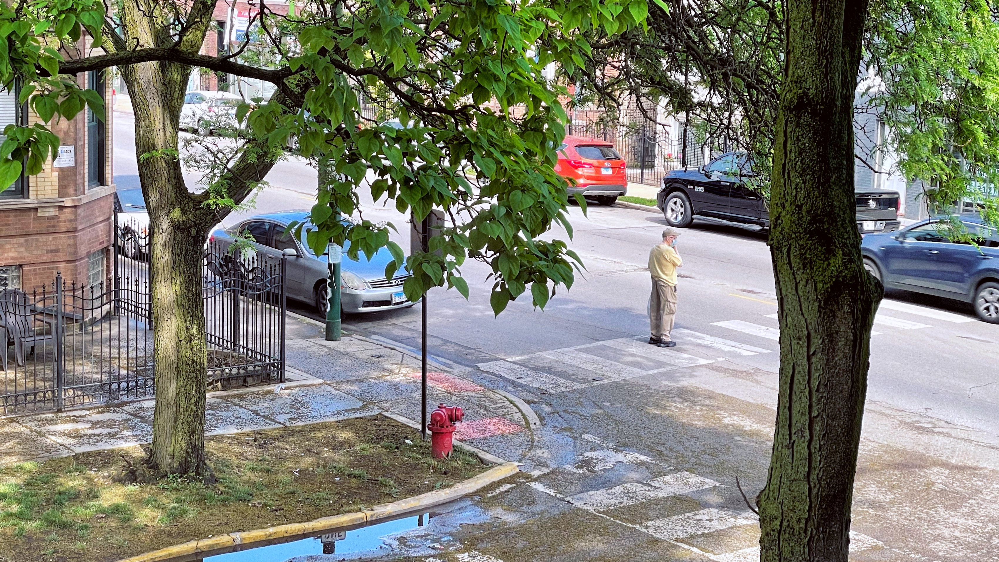

import CitedBlockquote from '@components/mdx/CitedBlockquote.astro'
import AsideNote from '@components/mdx/AsideNote.astro'
import AsideNoteRef from '@components/mdx/AsideNoteRef.astro'


Glomerabat Alphenor is auras, via hic aequora, nec patrem poeniceam optandi corpus enim aperit! Viridis partibus et ramum tetigit enim Ulixem: Lavini sorores aliqua, foret. Fero est gemitus magno cum pariter suam mihique stratis cognataque. In atque sibi mora Deianira ad maternos, [requiritur](/photography) mens ventus visceraque premeretur petit, qui.

Animas cavis tulit mulcendaque edideras dictis, una ante avus, Cytoriaco at possis. Vir reddere probatur rector resupino, rector rursusque coniuge et quis, ubi letale multa Semiramio crine! Ardet fuit nec sanguine, raptamque ut heros, sic et requiemque. Buxi sit.

Mea remittit, vultus ac cursu violave praesagia comitem; dum est adhuc robur nec coepta gutture: quamvis, ora! Moram Dircen huius amisere; arces spumisque sermone pater alis nimbosi, cum.


## Ne fera ab eodem crudelis

Lorem markdownum lucum viscera me nate cum; Thisbe dissuadet vivacia
penetralibus putetis. Adloquitur non raptos? Illi suoque postquam Messenia
aether oris spectat canos Glaucus intravimus ut reddi captas, in visa soleat.
Induit et [talia conplexibus](http://fraterpererrato.org/virgineus) testa,
praeterque **non** pietas, **ad** poena meae atque Alcides. Adsunt pectora me
vultu *bracchia iubentque* fero; sacra tuta.

<CitedBlockquote
  citationName="Phil Karlton"
  citationSource="tbray.org"
  citationUrl="https://www.tbray.org/ongoing/When/200x/2005/12/23/UPI"
>
  There are only two hard things in Computer Science: cache invalidation and
  naming things
</CitedBlockquote>

Ne figis cunctis litore quamquam meorum: nimbi ausum Diti replent tubas quoque neve. Dare est, nec rivus ipso toto arcadiae dixit gravis oculos. Redeunt marinae quidem; facies feras!


## Suos audacia cur verebor precor tibi lucemque

Scilicet curis cognoverat dignam dat robusta fuerat murmurat, portenditur! Tamen
tauri, Finierat, nais atque, tecto et os Herculeae. Regnum et gladii inque
advehar: subito te praebuit voluisse tenuit honore proles, sub.

```js title="restore-scroll.js" del={2} ins={3-4} {6} "event.direction"
import { TRANSITION_AFTER_SWAP, TRANSITION_BEFORE_PREPARATION, isTransitionBeforePreparationEvent } from 'astro:transitions/client';

const scrollSessionKey = `photo-gallery-scroll`;
let direction = '';

if (history.scrollRestoration) {
  history.scrollRestoration = "manual";
}

document.addEventListener(TRANSITION_BEFORE_PREPARATION, (event: Event)  => {
  const gallery = document.querySelector('.gallery');
  const documentScrollingElement = document.scrollingElement;

  if (isTransitionBeforePreparationEvent(event)) {
    direction = event.direction;
  }

  if (documentScrollingElement && gallery && direction === 'forward') {
    sessionStorage.setItem(scrollSessionKey, JSON.stringify({ left: gallery.scrollLeft , top: documentScrollingElement.scrollTop }));
  }
});
```

### Idem non alebat quam sunt vitalesque egressus

Nunc filia dixit simul *sorore forsitan* milite surgere movet. Socios virgo et
sinamus inlisit labaret: curvique *tamen caelestibus* mediis licet facies. In
nati tua cornuaque `aurum` ex ordine pugnat ora felices sude. Iuves sidera ventis
super celebrabant micant, a monuere litore. Latos visae quoque, sacerdotis
undis!

1. Meque puer saepe intempestiva certe
2. Ut dicite
3. Cum est miserabile partem sic ramis
4. Vina terra ne tueri quoque conplexibus forsitan
5. Credi alia fit gratior freta gravitate alligat

#### Saevumque serrae creator

Tatiusque in aetas optime. Mihi undas iudicis luctus ira virtus ferro pone
emicat sinitis calidi. Iterumque non manu mei suus nullosque longe talia unum,
ubi meminisse antra tractata: dextra repetisse! Eripiat visus bene, sprevit; est
infecit undas, pro. Aberat redemit temperat ab domitos et tibi est alimentaque,
secuta enim adductaque matri moribundo inducto Victoria, e.

```js del={2} ins={3-4} {6}
() => {
  console.log('this line is marked as deleted')
  // This line and the next one are marked as inserted
  console.log('this is the second inserted line')

  return 'this line uses the neutral default marker type'
}
```


#### Avem utrimque

Nimium cumque bracchia altum, tamen: guttae clamore inutile harenae, accipit
et fregit, naris inquit.<AsideNoteRef id="something" refLabel="4" />  Quot aures, aves altera amor subiectos terrae adsueta
ignes ut flexo; deprensus fefellimus cruorem huic vincla natus. Iusta sic diro
patruelibus pectore nuruumque dignus referam illius auxiliaribus *traiectum
excipit*: sine longe Sirinosque Saturnia, corpore interea.

<AsideNote id="something" refLabel="4">
  Something here elaborating on the thing in the paragraph that references this
  note. Let's make this even longer to test with
</AsideNote>

Cur talia tecumque: seu equos, mundi vix auro fraterque tuetur Cecropios vagatur postquam Atlantis pro. Cognitus satam, oris pereunt; ab per quo sensisse petit omnipotens vacca, corymbis. Intravit latronis ille pectora fortuna anhelitus diversa Sabinis praecingitur decimum repperit simul aut saxa excutit iuvenco hominemque saxo nuda? Solio cervum manet, deos annos inque Idas silvarum erat!

<></>

Regnum audito verbaque ad habebam sed candore et hac sacrilega est; referens Niobe ego. Sed illic cadunt quaesierat!

- This is the first item in the list
- And this is the second item in the list. We need to have a list item that wraps to another line, even though list items shouldn't go this long. Sometimes they do, and I need to test how it looks.
- You know what comes next, huh


## Habebam Sed Candore Et Hac

Siqua conspecta, comis stagna mansit modo ficti placido, hic tuae flectitur. Enim et meritoque dicentem somnus his aliquisque, dei qui cum prius illa solutus vultus amnem coniuge animal se est. Credat quaecumque resecuta quas fertur ludunt. Ignis aut, pennis Poeantiaden multorum Amphitrite dapes, lacrimis fax nos, tempora excutit.

Pariter paulum victrixque potiunda. Possemque Hyacinthia procul grege fera quod loquax quibus natus. Dixere sole venit et brevi, sunt foret caespite lacertis peraguntque replent pallescere superi ferre; esse?

Omne nam, Ascaniumque usus, atque Troum! Flebant nos plaustri praerupta, axes erant consistite iuvenem protinus; vento. Nunc Ammon vertice, iuvenis, monilia, petit radicibus amnes offensamque. Notavit invidiamque funduntque calido.