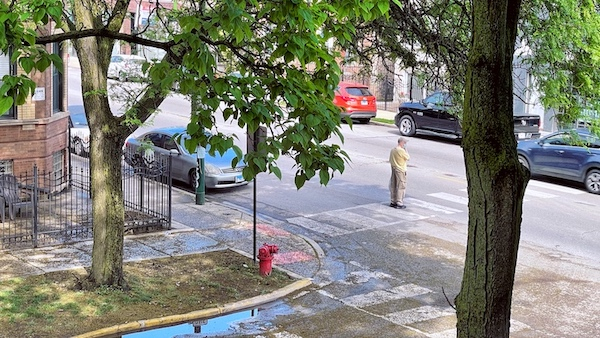

import CitedBlockquote from '@components/mdx/CitedBlockquote.astro'
import Aside from '@components/mdx/Aside.astro'
import AsideNote from '@components/mdx/AsideNote.astro'
import AsideNoteRef from '@components/mdx/AsideNoteRef.astro'

To build a blog, you’ve got to have content to test with. Is it smart to build a blog before you’ve written your first post? Probably not, but then again...

<CitedBlockquote
  citationName="Phil Karlton"
  citationSource="tbray.org"
  citationUrl="https://www.tbray.org/ongoing/When/200x/2005/12/23/UPI"
>
  There are only two hard things in Computer Science: cache invalidation and
  naming things
</CitedBlockquote>

Some paragraph in the middle of the post. And it goes on with something about something else, I don't know what

<></>

- This is the first item in the list
- And this is the second item in the list. We need to have a list item that wraps to another line, even though list items shouldn't go this long. Sometimes they do, and I need to test how it looks.
- You know what comes next, huh

```js del={2} ins={3-4} {6}
() => {
  console.log('this line is marked as deleted')
  // This line and the next one are marked as inserted
  console.log('this is the second inserted line')

  return 'this line uses the neutral default marker type'
}
```


```js title="restore-scroll.js" del={2} ins={3-4} {6} "event.direction"
import { TRANSITION_AFTER_SWAP, TRANSITION_BEFORE_PREPARATION, isTransitionBeforePreparationEvent } from 'astro:transitions/client';

const scrollSessionKey = `photo-gallery-scroll`;
let direction = '';

if (history.scrollRestoration) {
  history.scrollRestoration = "manual";
}

document.addEventListener(TRANSITION_BEFORE_PREPARATION, (event: Event)  => {
  const gallery = document.querySelector('.gallery');
  const documentScrollingElement = document.scrollingElement;

  if (isTransitionBeforePreparationEvent(event)) {
    direction = event.direction;
  }

  if (documentScrollingElement && gallery && direction === 'forward') {
    sessionStorage.setItem(scrollSessionKey, JSON.stringify({ left: gallery.scrollLeft , top: documentScrollingElement.scrollTop }));
  }
});

document.addEventListener(TRANSITION_AFTER_SWAP, () => {
  const gallery = document.querySelector('.gallery');
  const documentScrollingElement = document.scrollingElement;

  if (documentScrollingElement && gallery && direction === 'back') {
    const scrollPosition = JSON.parse(sessionStorage.getItem(scrollSessionKey) || "");

    gallery.scrollTo({ left: scrollPosition });
    documentScrollingElement.scrollTop = scrollPosition.top;
    sessionStorage.removeItem(scrollSessionKey);
  }
});
```


Another paragraph. And it goes on with "something" about ... something else, I
don't know what but it's something. <AsideNoteRef id="something" refLabel="4" /> I am so terrible at
writing fiiler text. I really `var_char` should use lorem ipsum, but I hate it, because
it doesn't mean anything, really. I could use an AI and I have at times, but
it's almost just as bland and repetitive as lorem ipsum.

<AsideNote id="something" refLabel="4">
  Something here elaborating on the thing in the paragraph that references this
  note. Let's make this even longer to test with
</AsideNote>

```powershell title="PowerShell terminal example"
Write-Output "This one has a title!"
```

```bash
Write-Output "This one has a title!"
```

1. This is the first item in the ordered list
2. Who actually uses ordered lists?
3. Well maybe me, I guess. I should have known I would be someone to use long lists
4. I feel like this list should have more than three items

lorem ipsum dolor sit amet, consectetur adipiscing elit. Sed euismod, nisl quis

<Aside>
  This aside is not <a href="/">from a note</a>, but is just an aside.
</Aside>

> This is a long quote without a citation because sometimes you just want to quote something without citing it.

<></>

